## Overview

**Novel Nexus** is a P2P Book Exchange web application designed to facilitate the easy exchange of physical books. By leveraging a Peer-to-Peer model, the platform aims to breathe new life into books that are no longer being read, reducing waste and promoting a culture of sharing and sustainability among readers.

## Features

- **User Profiles**: Multiple login options at your disposal, track your book exchange history, and manage your book listings.

- **Book Listings**: Easily list the books you're willing to exchange, complete with details like book condition, genre, and author.
  - **Metadata**: Since Novel Nexus is built with `next.js` it can render meta information when sharing with other users. 
  - In my opinion, this feature is very important as the receiver can preview the content the book even before he opens the web which might spark his interest

- **Exchange Requests**: Send and receive exchange requests from other users, with the ability to accept, reject, cancel, delete completed exchanges.

- **Full Text Search**: Find books of interest through a comprehensive full text search feature base on genre, title description and author

- **Borrow Credit System**: Earn credits by lending your books, which can then be used to borrow books from others.
  - **Seed**: Meet the `seed` credit system where users accumulate their `seed` by lend out their books and grow them into a big knowledge tree by borrowing more books from the other users
  - Users are give 500 `seed` credits to start off their book search journey


## Tech Stack
- Webapp: Next.js,  Tailwind CSS, Shadcn
- Database: Prisma, PostgreSQL
- Authentication: Clerk

## Deployment
Currently the app is deployed on vercel at [link](https://novel-nexus-three.vercel.app/)
To speed up the prototyping process, everything is using a hosted service
1. **File Storage**: Vercel blob storage
2. **Postgres**: Vecel Headless Postgres
3. **Embedding**: OpenAI

## Roadmap and current limitation
- **Sorting,Filtering and Pagniation**: These are essentail component that greatly enhance the user experience and reduce server load.
  
- **Bot Chat**: Engage with our AI-powered bot for recommendations, platform navigation help, and more.
- **Exchange Logic**: The current exchange logic is very simplified, need more enhancement
  - Now the bulk of the rights are with the book owner, who can approve and complete a exchange 
  - Whereas the requestor only has the ability to cancel a request if it is still pending
  - ideally, both party should acknowledge the start and end of an exchange
  - email notification is necessary

- **User Chat**: Connect directly with other users to discuss book exchanges, coordinate shipping, or simply share your love for reading.
  - Should include the ability for the owner to edit the price for a specific requestor
- **Rating System**: Let users have the ability to rate each other and the book that is borrowed
- **Recommendation Engine**: Base on user's past search/borrow history, recommend the revelant books to the user
- **Credit System**: The current version of the credit system only have simple deduction of the `seed` amount from the user's credit upon completing exchange
  - Consider things like the cost of borrowing a book is it a `per day` or `per n days` 
- **Scalability**: Current way of writing code did not take into consideration of a `microservice` architecture, which will definitely have a lot of problem with distributed transactions during high throughputs. 
  - A proper distributed transaction management system is required
## Getting Started

### Prerequisites

- Vecel Account (or a file storage alternative)
- Docker
- Clerk Account

### Environment variables 
Create a `.env` file using 
```cp .env-example .env```
fill in the necessary fields
To find the relevant fields read through 
- [clerk](https://clerk.com/docs/quickstarts/setup-clerk) setup guide. 
- Obatin [OpenAI](https://openai.com/blog/openai-api) api token
- Vercel [Blob](https://vercel.com/docs/storage/vercel-blob) and [Postgres](https://vercel.com/docs/storage/vercel-postgres)

### Running the Application
To Run the application, make sure the environment variables are all filled and run

```
npm -i
npm run dev
```
if you are using a new db you will need to run 
```
npx prisma db push
```
before running the app

The application can be run through docker using the [Dockerfile](./Dockerfile) or [DockerCompose](./docker-compose.yml)
I did not really test this, since towards the end all of the dependencies are hosted

## Usage
### Signin Page
By default all routes are protected by the clerk signin, I know some pages do not need and should not need like the book detail page, but this is just a minor change so, im leaving it for the next time
By visting any url you will be greeted by the clerk signin form

Here you can choose to you the login methods of your choice; A user name is required for this project. If you use email signup, a `verification email` will be sent with a code to signup

### Main Page
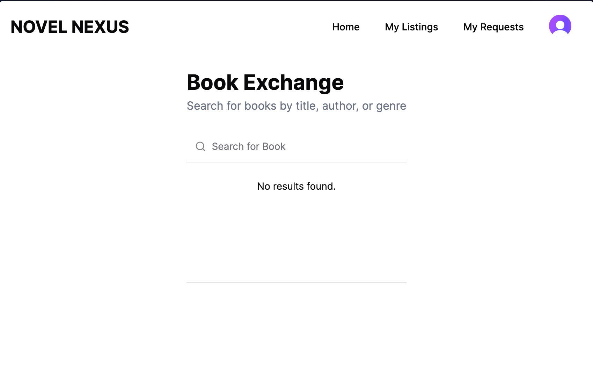
Here you will see the main page that will display all the book listings available, theres none as it is a clean start
But onces a new book is created, it will be shown on the main page
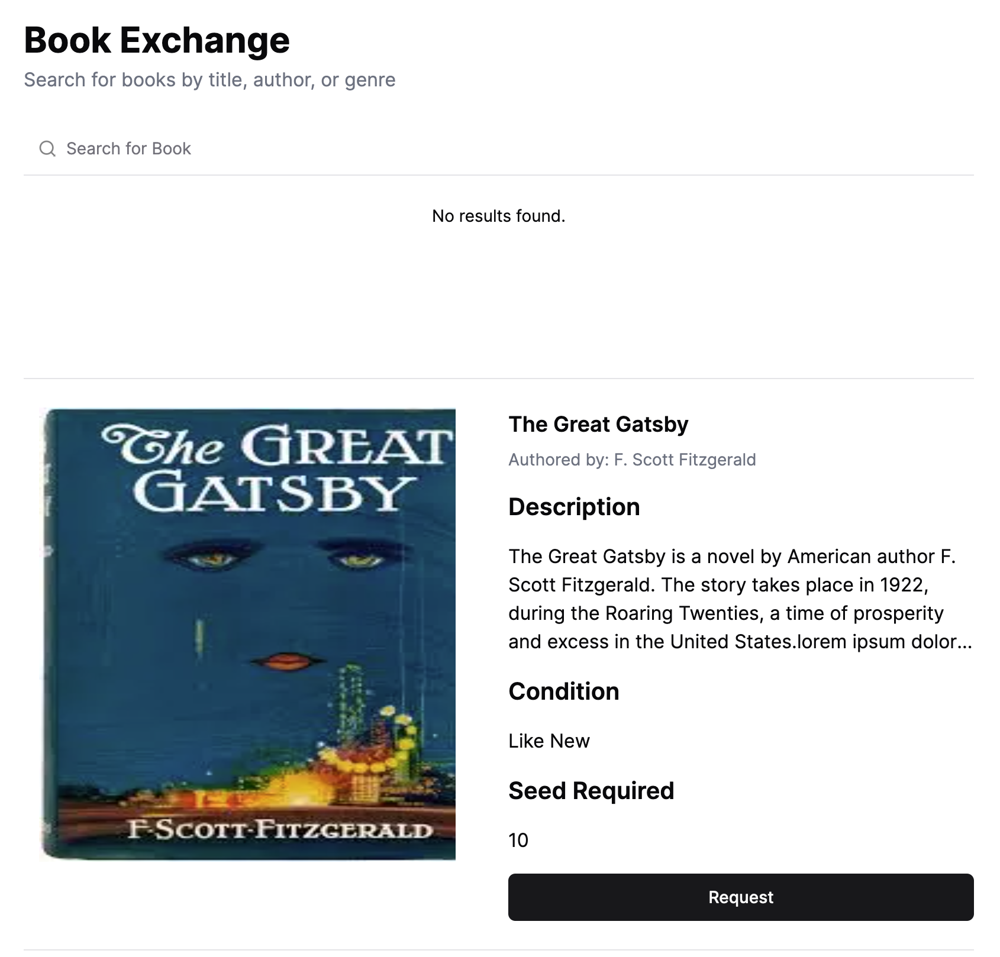
#### Search
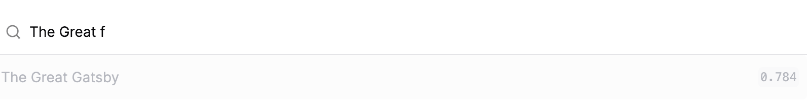
using the search bar, you can search by title, author or genere, it is a full text search with the results displayed, the similarity score is on the right
(styling can be improved, should add a navigation to the book details page when user select)
### Book detail
Click on the book's text area will lead you to the book's detail page
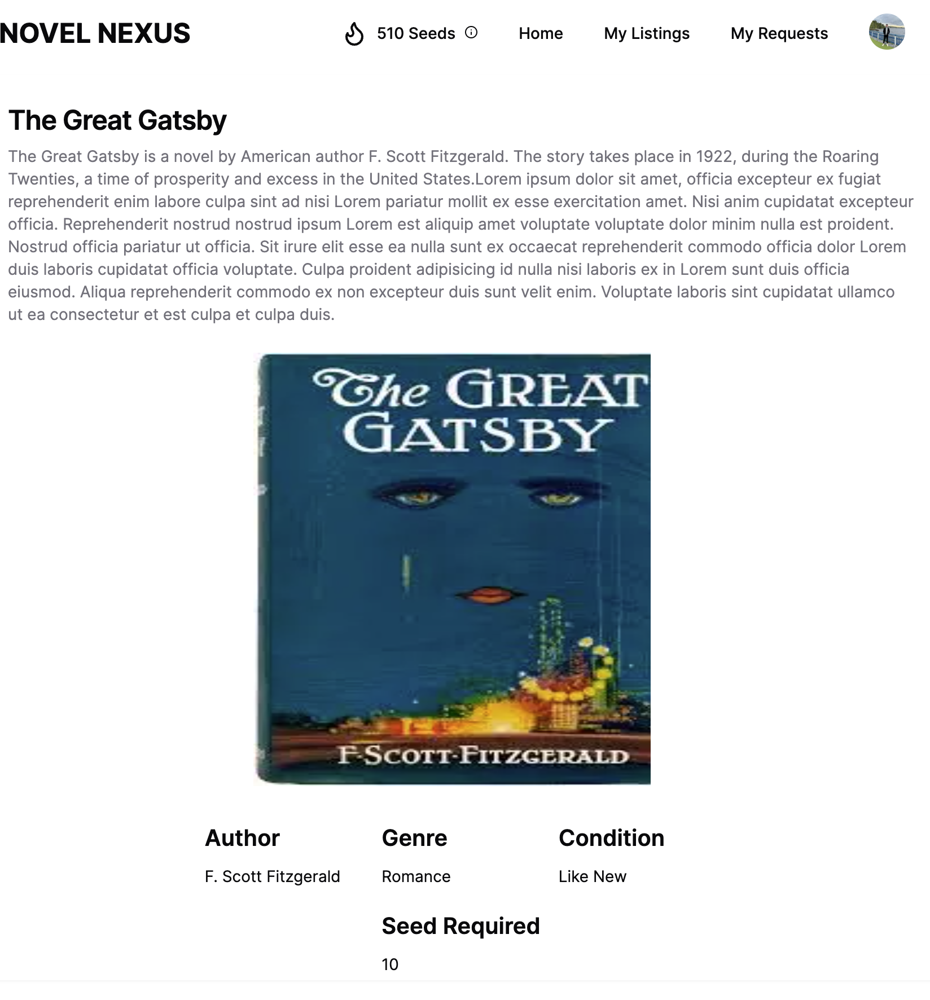
This page is serverside rendered with meta tags, hence copy and pasting this url in social media will render a preview. if the authentication protection is remove :D


### Create New Listings
Go to my listings and click on `Upload New Book` This button was originally in the main page but moved here to make the responsibility of the UI clearer
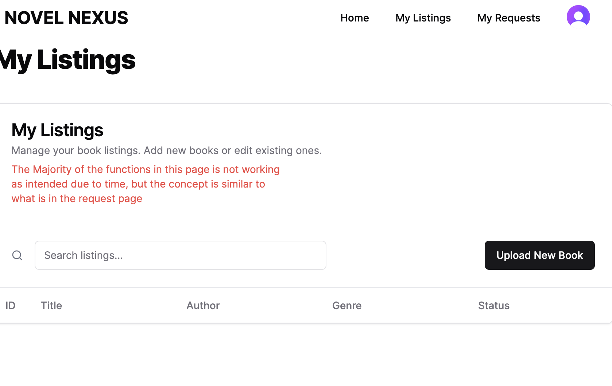
A New book form will pop up and filling the necessary details will create a new Book. You can upload multiple images which will be displayed in a not so fine tuned carousel
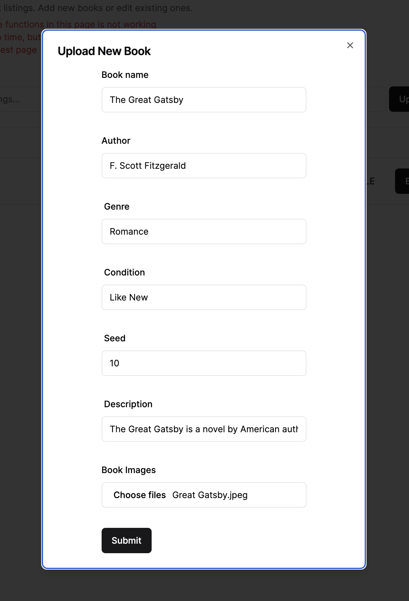
After which, do a manual refresh of the page(by right should revalidate, some bug that i got no time to fix) and you should see the book listing appearing

Now go to the home page, The book listing is there too
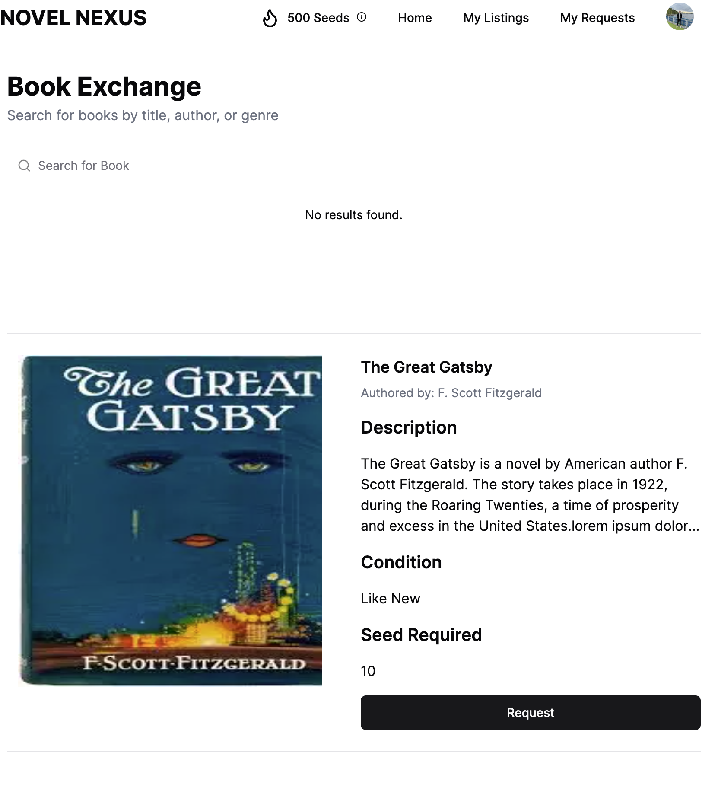

### Switching Account
Sign up a second account and try to view the home page, you should see the same content and you can start sending a request to the owner by clicking on the request button 
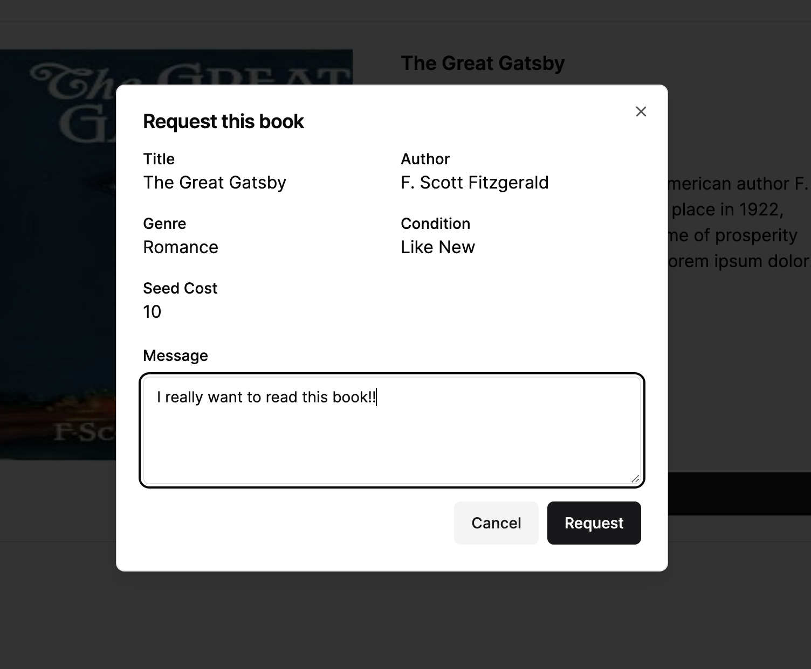
You can enter your message to convince the owner to lend to you

### Managing requests
Go to `My Requests` page and you should see the borrow request that you just made
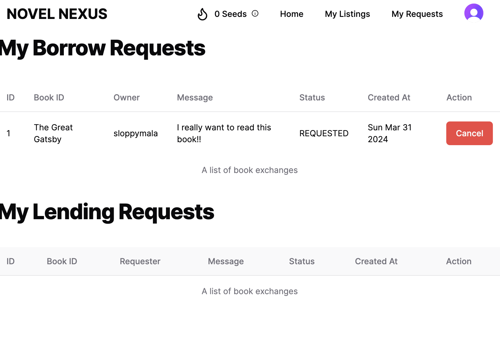
You can cancel the request if the request status is still REQUESTED

Now Log back into the book owner, go to the same `My Requests` Page, do a hard refresh on the browser to clear cache(This is a unintended effect of caching) You will see a lending request appear where you can `Accept/Reject`
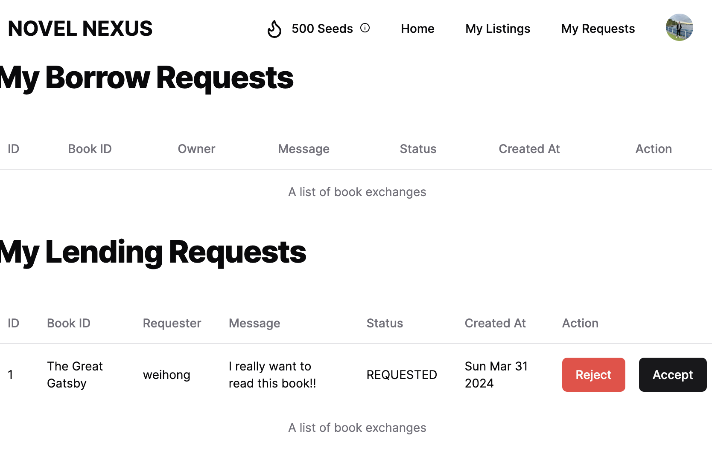

Upon Click on Accept, the status will be updated and the page will update accordingly just that there isnt UI feedback on the loading
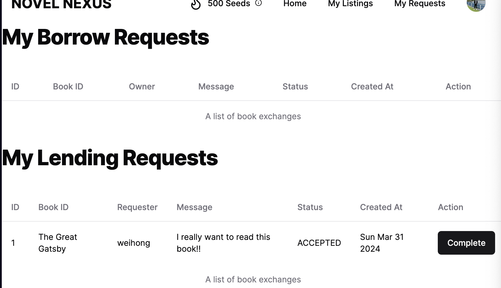

You can click on the `Complete` button to mark the end of the lending when the requester return the book and the amount of credit should be added to you seed balance
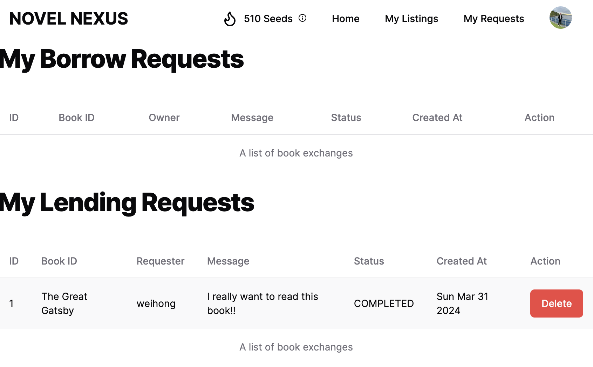

## Final Thoughts
Thank you for reading this I am just gonna dump some of my thoughts here about this POC:

I have been wanting to a full stack app using next js for quite some time, but due to other project requirements, most of the time it is a frontend and backend seperate architecture using different frameworks. 

This project allow me to see how fast I can build and deliver something (for me, not very sure if it slow progress for heymax)

The ability to directly interact with the database or api route straight from the server code is just amazing, it removes so many unnecessary layers between the frontend and backend and just get the things done! Together with the fast deployment solutions and hosted services by Vecel, the speed is just insane. I truely love this. Even though Vecel charge high when the app scales, but i guess as POC, Vecel is a really good platform

I really want to build in a chatbot, but due to time, i cant really finish it. But i think it is easy in this case since the full text search is utilising the embeddings, we can build retrieval tools and chains easily using langchain. I am just not so familiar with langchain's js library, hence i think its gonna take much more time and i gotta let it go.
It is a simple feature to build as compared to something like a recommendation engine and it give some interactivity to the users too. but yah sad :(

Lastly, I put in significant amount of effort for this project (17 Hours and counting) is because i really love building something and i truely find it interesting and fun to learn new ways to approach things. Originally I was quite stressed out cos its a `interview assignment` but as i get into the development momentum, i start to enjoy the part where the different components come together and finishes the app. 

Of course, I still eagerly want to be part of HeyMax, I have watched various videos and interviews and blogs about HeyMax and i think HeyMax is really the kind of tech start up that i want to be in! 

Thank you for reading until here!

PS: BTW i found a really cool platform called [v0.dev](https://v0.dev) that generates a ui base on a prompt. Some components in this project is generated and modified from there. The idea of prompt to ui something that i want to build but i have no clue where to start. Haish